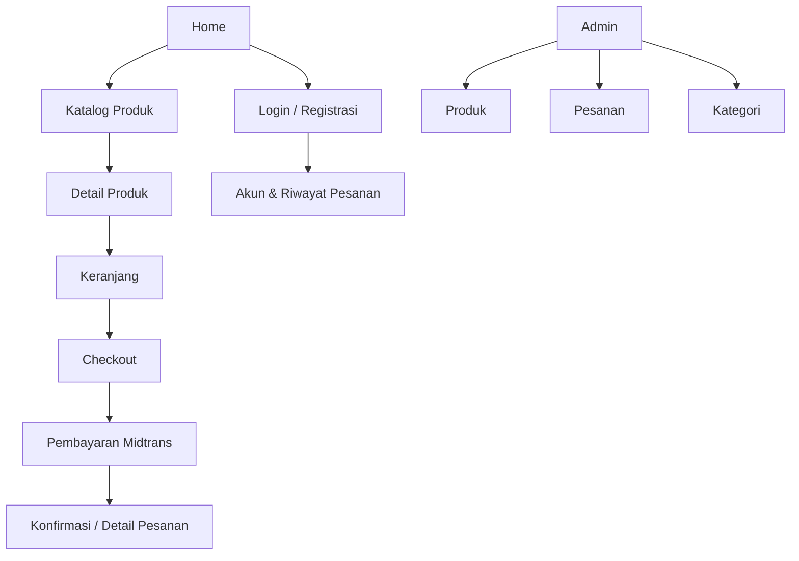
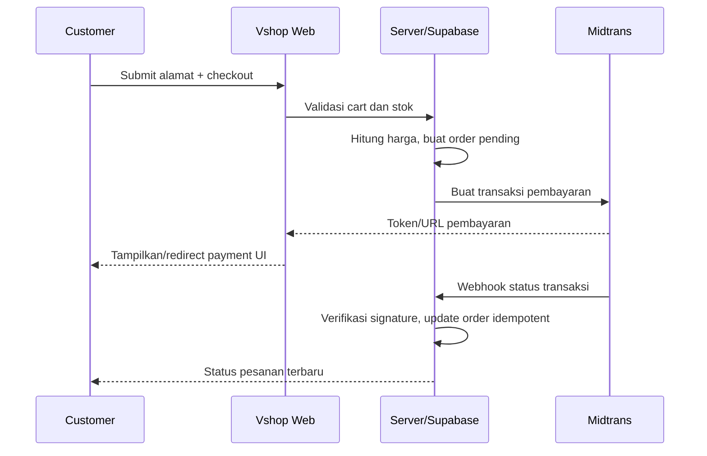

# Vshop Product Requirements Document (PRD)

## Ringkasan Eksekutif

Vshop adalah platform e-commerce web open-source untuk UMKM dan developer Indonesia. Produk ini menjawab kebutuhan akan fondasi toko online modern yang dapat diluncurkan cepat tanpa biaya lisensi platform komersial, sambil tetap mendukung alur utama penjualan: pengguna membuat akun, menemukan produk, menambahkan produk ke keranjang, menyelesaikan checkout, lalu membayar melalui Midtrans.

Target utama Vshop adalah pemilik UMKM yang membutuhkan toko online sederhana serta developer freelance yang ingin menyelesaikan proyek klien menggunakan starter kit yang maintainable. MVP dibatasi pada katalog produk single-store, autentikasi, keranjang, checkout, pembayaran, dan administrasi dasar. Marketplace multi-vendor, program promosi, multi-mata uang, serta aplikasi mobile native bukan bagian MVP.

Keberhasilan MVP diukur melalui deployment <30 menit, penyelesaian alur checkout end-to-end di sandbox Midtrans, LCP halaman katalog <=2,5 detik pada jaringan 4G representatif, serta setidaknya 50 toko atau implementasi komunitas pada fase awal.

## Tujuan Produk

| ID | Tujuan | Indikator Keberhasilan |
|----|--------|------------------------|
| OBJ-01 | Membuat toko online dapat dipasang cepat | Clone sampai deploy <=30 menit |
| OBJ-02 | Menyediakan pengalaman belanja inti | Customer dapat register sampai membuat pesanan |
| OBJ-03 | Mendukung pembayaran lokal | Callback/status Midtrans dapat memperbarui pesanan |
| OBJ-04 | Memudahkan pengelolaan katalog | Admin dapat CRUD produk tanpa akses database langsung |
| OBJ-05 | Menjadi starter kit komunitas | Dokumentasi instalasi, env, API, dan kontribusi tersedia |

## Non-Goals

| ID | Tidak Dikerjakan pada MVP | Alasan |
|----|---------------------------|--------|
| NG-01 | Multi-vendor marketplace | Membutuhkan komisi, settlement, KYC, dan model data baru |
| NG-02 | Multi-currency/multi-language | Fokus validasi pengguna Indonesia + Rupiah |
| NG-03 | Promo, loyalty, referral | Tidak diperlukan untuk alur transaksi inti |
| NG-04 | Aplikasi mobile native | Web responsive mencakup kebutuhan awal |
| NG-05 | Sinkronisasi marketplace/ERP | Kompleksitas integrasi tinggi, belum memvalidasi core flow |

## Persona Pengguna

### P-01 — Siti, Pemilik UMKM
| Atribut | Detail |
|---------|--------|
| Profil | Pemilik toko kebutuhan rumah tangga, 42 tahun |
| Kemampuan teknis | Rendah; nyaman memakai aplikasi umum |
| Tujuan | Menjual katalog sendiri tanpa marketplace fee tinggi |
| Hambatan | Tidak memahami database, deployment, maupun konfigurasi kompleks |
| Kebutuhan produk | Toko mudah digunakan, checkout jelas, admin sederhana |

### P-02 — Dika, Developer Freelance
| Atribut | Detail |
|---------|--------|
| Profil | Developer Next.js freelance, 26 tahun |
| Kemampuan teknis | Tinggi |
| Tujuan | Memulai proyek toko klien tanpa boilerplate berulang |
| Hambatan | Integrasi auth, database, dan payment sering memakan waktu |
| Kebutuhan produk | Struktur kode jelas, type-safe, dokumentasi env dan API |

### P-03 — Raka, Kontributor Open Source
| Atribut | Detail |
|---------|--------|
| Profil | Mahasiswa/pengembang awal karier, 22 tahun |
| Kemampuan teknis | Menengah–tinggi |
| Tujuan | Belajar pola full-stack modern dan berkontribusi |
| Hambatan | Proyek open-source sering sulit dijalankan lokal |
| Kebutuhan produk | Issue jelas, setup sederhana, standar kualitas konsisten |

## User Stories

| ID | Prioritas | User Story | Acceptance Criteria Ringkas |
|----|-----------|------------|-----------------------------|
| US-01 | P0 | Sebagai pengunjung, saya ingin mendaftar agar dapat menyimpan identitas dan membuat pesanan. | Email valid; password memenuhi aturan; akun dibuat; verifikasi/error jelas. |
| US-02 | P0 | Sebagai customer, saya ingin login agar dapat mengakses checkout dan pesanan saya. | Kredensial benar membuka sesi; salah menampilkan pesan aman; redirect kembali ke tujuan awal. |
| US-03 | P0 | Sebagai pengunjung, saya ingin melihat daftar produk agar dapat menemukan barang untuk dibeli. | Produk aktif tampil dengan gambar, nama, harga; paginasi/filter bekerja. |
| US-04 | P0 | Sebagai customer, saya ingin melihat detail produk agar dapat menilai sebelum membeli. | Detail, harga, stok, gambar, dan CTA terlihat; produk tak aktif tak dapat dibeli. |
| US-05 | P0 | Sebagai customer, saya ingin menambah item ke keranjang agar dapat checkout beberapa produk sekaligus. | Kuantitas tervalidasi terhadap stok; total diperbarui; item tidak duplikat. |
| US-06 | P0 | Sebagai customer, saya ingin mengubah keranjang agar pesanan sesuai kebutuhan saya. | Tambah, kurang, hapus item; subtotal dan total diperbarui. |
| US-07 | P0 | Sebagai customer, saya ingin checkout agar pesanan dibuat dan dapat dibayar. | Validasi alamat; server hitung harga; order pending terbentuk; payment token dibuat. |
| US-08 | P0 | Sebagai customer, saya ingin mengetahui status pembayaran agar yakin pesanan diproses. | Status diperbarui dari webhook tervalidasi; tampilan status jelas. |
| US-09 | P0 | Sebagai admin, saya ingin mengelola produk agar katalog selalu akurat. | Admin saja; create/edit/archive produk; input tervalidasi. |
| US-10 | P0 | Sebagai admin, saya ingin melihat dan memperbarui pesanan agar fulfillment dapat dijalankan. | List pesanan; filter status; status transisi tervalidasi. |
| US-11 | P1 | Sebagai customer, saya ingin reset password agar dapat kembali masuk. | Email reset dikirim tanpa mengungkap apakah email terdaftar. |
| US-12 | P1 | Sebagai customer, saya ingin riwayat pesanan agar dapat melacak pembelian. | Hanya pesanan milik pengguna aktif yang tampil. |
| US-13 | P2 | Sebagai customer, saya ingin wishlist agar dapat menyimpan produk untuk nanti. | Dicatat sebagai pertimbangan fase 2. |

## Feature Requirements

### FR-P-01 — Autentikasi dan Profil
| Atribut | Detail |
|---------|--------|
| Prioritas | P0 |
| User stories | US-01, US-02, US-11 |
| Deskripsi | Pengunjung dapat register, login, logout, dan reset password. Sistem membedakan `customer` serta `admin`. |
| Dependensi | Supabase Auth, tabel `profiles`, konfigurasi email redirect URL |
| Selesai apabila | Sesi aman tersedia; route admin ditolak untuk non-admin; error tidak membocorkan akun. |
| Edge cases | Email sudah dipakai, sesi kedaluwarsa, link reset expired, callback auth gagal. |

### FR-P-02 — Katalog dan Detail Produk
| Atribut | Detail |
|---------|--------|
| Prioritas | P0 |
| User stories | US-03, US-04 |
| Deskripsi | Halaman katalog menampilkan produk aktif beserta category/filter dasar. Halaman detail menampilkan informasi pembelian. |
| Dependensi | Tabel `products`, `categories`, storage gambar |
| Selesai apabila | Produk nonaktif/archived tidak terlihat di publik; harga format Rupiah; halaman responsif. |
| Edge cases | Stok habis, gambar gagal dimuat, slug tidak ditemukan, produk dinonaktifkan saat ada di cart. |

### FR-P-03 — Keranjang Belanja
| Atribut | Detail |
|---------|--------|
| Prioritas | P0 |
| User stories | US-05, US-06 |
| Deskripsi | Customer menambah, memperbarui kuantitas, atau menghapus item keranjang; UI menampilkan subtotal dan total estimasi. |
| Dependensi | State client/session atau tabel `carts` + `cart_items`; produk aktif |
| Selesai apabila | Tidak dapat menambahkan melebihi stok; kuantitas minimum 1; harga final dikalkulasi ulang server saat checkout. |
| Edge cases | Stok turun sesudah masuk cart, item dihapus admin, user membuka dua tab, harga berubah. |

### FR-P-04 — Checkout, Pesanan, dan Pembayaran
| Atribut | Detail |
|---------|--------|
| Prioritas | P0 |
| User stories | US-07, US-08, US-12 |
| Deskripsi | Customer mengisi alamat, mengonfirmasi order, lalu dialihkan/ditampilkan payment interface Midtrans. Webhook terverifikasi mengubah status pembayaran dan pesanan. |
| Dependensi | Auth, cart, alamat, tabel order, Midtrans, endpoint webhook |
| Selesai apabila | Harga dihitung pada server; order memiliki nomor unik; webhook idempotent; customer melihat status final. |
| Edge cases | Pembayaran pending/expire/deny/cancel, webhook duplikat, nominal/currency tidak cocok, item habis saat checkout. |

### FR-P-05 — Administrasi Produk dan Pesanan
| Atribut | Detail |
|---------|--------|
| Prioritas | P0 |
| User stories | US-09, US-10 |
| Deskripsi | Area `/admin` untuk mengelola produk, melihat pesanan, dan mengubah status fulfillment sesuai aturan transisi. |
| Dependensi | Role `admin`, RLS Supabase, audit log opsional |
| Selesai apabila | Non-admin tidak mendapat data admin; penghapusan produk tidak merusak riwayat order; perubahan pesanan dicatat. |
| Edge cases | Produk sudah ada di order, update bersamaan, transisi status tidak valid. |

### FR-P-06 — Dokumentasi dan Developer Experience
| Atribut | Detail |
|---------|--------|
| Prioritas | P1 |
| User stories | P-02, P-03 |
| Deskripsi | README memandu instalasi, environment variables, migrasi database, Midtrans sandbox, deployment, dan kontribusi. |
| Selesai apabila | Kontributor baru dapat menjalankan lokal dari dokumen tanpa knowledge internal. |

## Information Architecture



### Halaman Kunci

| Halaman | Tujuan | Komponen Kunci | Breakpoint |
|---------|--------|----------------|------------|
| `/` | Entry point/promosi toko | Header, hero, produk unggulan, footer | Mobile 1 kolom; desktop grid |
| `/products` | Menemukan produk | Search/filter, grid produk, pagination | Filter drawer mobile; sidebar desktop |
| `/products/[slug]` | Evaluasi produk | Galeri, harga, stok, quantity selector, add-to-cart | Galeri stack mobile; dua kolom desktop |
| `/cart` | Meninjau pembelian | Line item, quantity controls, total, CTA checkout | Ringkasan sticky desktop |
| `/checkout` | Mengumpulkan alamat dan konfirmasi order | Form alamat, order summary, CTA payment | Satu kolom mobile; summary sticky desktop |
| `/account/orders` | Riwayat pesanan customer | Daftar/detail pesanan, status pembayaran | Card mobile; table desktop |
| `/admin/products` | CRUD katalog | Table, form modal/page, archive action | Table scroll horizontal mobile |
| `/admin/orders` | Fulfillment | Filter status, order table, detail | Table scroll horizontal mobile |

### Wireframe Checkout

```text
+-----------------------------------------------------------+
| Logo                         Cart (n) | Account           |
+-------------------------------+---------------------------+
| Informasi Pengiriman          | Ringkasan Pesanan         |
| [Nama lengkap              ]  | Produk x Qty              |
| [No. telepon               ]  | Subtotal                  |
| [Alamat                    ]  | Pengiriman                |
| [Kota / Kode Pos           ]  | TOTAL                     |
|                               | [Lanjut Pembayaran]       |
+-------------------------------+---------------------------+
| Footer                                                    |
+-----------------------------------------------------------+
```

### Alur Checkout



## Data Model Produk

### Entitas `profiles`
| Field | Tipe | Wajib | Deskripsi |
|-------|------|-------|-----------|
| id | UUID | Ya | FK ke `auth.users.id` |
| full_name | text | Tidak | Nama tampilan customer/admin |
| role | enum | Ya | `customer` atau `admin`; default customer |
| phone | text | Tidak | Nomor kontak |
| created_at | timestamptz | Ya | Waktu pembuatan |

### Entitas `products`
| Field | Tipe | Wajib | Deskripsi |
|-------|------|-------|-----------|
| id | UUID | Ya | Primary key |
| category_id | UUID | Tidak | FK kategori |
| name | text | Ya | Nama produk, 3–160 karakter |
| slug | text | Ya | Unique URL identifier |
| description | text | Ya | Deskripsi produk |
| price | bigint | Ya | Harga dalam Rupiah integer, >0 |
| stock | integer | Ya | Stok, >=0 |
| image_url | text | Tidak | URL gambar utama |
| status | enum | Ya | `active`, `draft`, `archived` |
| created_at / updated_at | timestamptz | Ya | Audit waktu |

### Entitas `orders` dan `order_items`
| Field | Tipe | Wajib | Deskripsi |
|-------|------|-------|-----------|
| orders.id | UUID | Ya | Primary key |
| orders.order_number | text | Ya | Nomor order unik |
| orders.user_id | UUID | Ya | Customer pembuat order |
| orders.status | enum | Ya | `pending`, `paid`, `processing`, `shipped`, `completed`, `cancelled`, `expired` |
| orders.payment_status | enum | Ya | `pending`, `paid`, `failed`, `expired`, `refunded` |
| orders.total_amount | bigint | Ya | Nilai final snapshot |
| orders.shipping_address | jsonb | Ya | Snapshot alamat checkout |
| order_items.product_id | UUID | Ya | Referensi produk historis |
| order_items.product_name | text | Ya | Snapshot nama agar riwayat stabil |
| order_items.unit_price | bigint | Ya | Snapshot harga per unit |
| order_items.quantity | integer | Ya | Jumlah, >0 |

## Security Requirements

| ID | Kebutuhan |
|----|-----------|
| SEC-01 | Gunakan Supabase Auth; token tidak pernah disimpan manual di local storage aplikasi. |
| SEC-02 | Terapkan Row Level Security: customer hanya membaca profil, cart, dan order miliknya; admin mengelola data admin. |
| SEC-03 | Validasi seluruh input di boundary server (Zod atau ekuivalen). |
| SEC-04 | Harga, stok, dan total checkout wajib dihitung ulang server-side. Jangan percaya total dari client. |
| SEC-05 | Rahasia Midtrans/supabase service role hanya di server environment variable; tidak memakai prefix `NEXT_PUBLIC_`. |
| SEC-06 | Webhook payment wajib verifikasi signature dan diproses idempotent. |
| SEC-07 | Rate-limit endpoint auth dan payment token; catat error keamanan tanpa data sensitif. |
| SEC-08 | Seluruh koneksi produksi menggunakan HTTPS; sanitasi output untuk mencegah XSS. |

## Accessibility Requirements

| ID | Kebutuhan |
|----|-----------|
| A11Y-01 | Target WCAG 2.1 AA untuk komponen inti. |
| A11Y-02 | Semua aksi cart, checkout, dan admin dapat dioperasikan keyboard. |
| A11Y-03 | Form memiliki label eksplisit, error dikaitkan via `aria-describedby`, focus ke error pertama. |
| A11Y-04 | Gambar produk punya alt text bermakna atau alt kosong jika dekoratif. |
| A11Y-05 | Kontras teks/CTA minimal standar AA; status tidak hanya dibedakan warna. |
| A11Y-06 | Dialog/payment launcher menangani focus trap dan mengembalikan focus saat ditutup. |

## Technical Guardrails

| Area | Keputusan |
|------|-----------|
| Framework | Next.js App Router + TypeScript strict |
| Styling | Tailwind CSS, responsive mobile-first |
| Backend | Supabase Auth, PostgreSQL, Storage, RLS |
| Payment | Midtrans Snap/redirect + server webhook |
| Browser | 2 versi terbaru Chrome, Edge, Firefox, Safari; mobile Chrome/Safari terbaru |
| Performance | LCP <=2,5s, CLS <=0,1; gambar dioptimasi; query katalog paginated |
| Observability | Error tracking dan structured log server tanpa PII/payment secret |

## Milestone

| Fase | Durasi | Output | Kriteria Keluar |
|------|--------|--------|-----------------|
| 0. Foundation | Minggu 1 | Repo, env, schema, auth skeleton | Lokal dapat berjalan, RLS baseline aktif |
| 1. Core Commerce | Minggu 2–4 | Katalog, detail, cart | Customer dapat mengisi cart valid |
| 2. Checkout | Minggu 5–6 | Order, Midtrans sandbox, webhook | Pembayaran sandbox memperbarui order |
| 3. Admin | Minggu 7 | CRUD produk, order management | Admin-only flow aman dan usable |
| 4. Quality & Launch | Minggu 8 | Tests, docs, audit a11y/perf, deploy | Core acceptance criteria lulus |

## Open Questions

| ID | Pertanyaan | Owner | Dampak |
|----|------------|-------|--------|
| OQ-01 | Metode pengiriman/ongkir MVP: flat rate, pickup, atau provider? | Product | Perhitungan total checkout |
| OQ-02 | Apakah guest checkout dibutuhkan? | Product | Model cart/order dan auth flow |
| OQ-03 | Apakah produk mendukung varian (warna/ukuran) pada MVP? | Product | Model inventory dan UI detail produk |
| OQ-04 | Kanal notifikasi transaksi awal: email, WhatsApp, atau keduanya? | Product | Integrasi provider dan template |

## Revision History

| Versi | Tanggal | Perubahan | Penulis |
|--------|---------|-----------|---------|
| 1.0 | 2026-08-15 | Draft awal MVP Vshop | Tim Produk Vshop |
