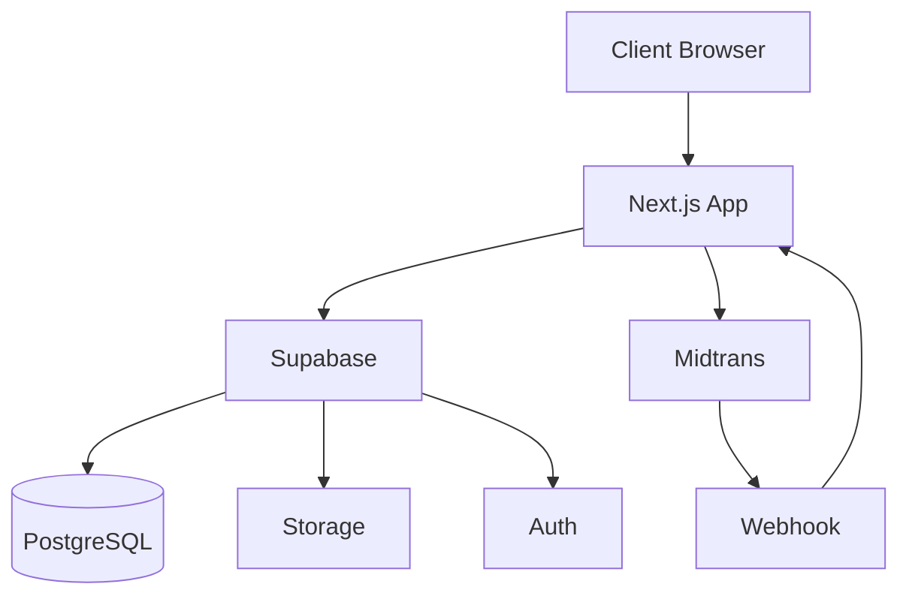

# Vshop Technical Requirements Document (TRD)

## 1. Overview

Dokumen ini menjelaskan persyaratan teknis untuk membangun Vshop. Fokus pada stack teknologi, arsitektur, skema database, keamanan, performa, dan deployment.

## 2. Stack Teknologi

| Layer | Teknologi | Versi | Alasan |
|-------|-----------|-------|--------|
| Frontend | Next.js App Router | 14.x | SSR/SSG, Server Components, Route Handlers |
| Styling | Tailwind CSS | 3.x | Utility-first, responsive, minimal CSS custom |
| Backend | Supabase | 2.x | Auth, PostgreSQL, RLS, Storage, Edge Functions |
| Payment | Midtrans | Snap/Redirect | Gateway lokal, dukungan kartu & e-wallet |
| Testing | Jest + Playwright | Latest | Unit + E2E testing |
| CI/CD | GitHub Actions | Latest | Workflow otomatis |
| Hosting | Vercel | Hobby/Pro | Deployment Next.js optimal |
| Database | PostgreSQL | 15+ | Supabase managed |

## 3. Arsitektur Sistem



### 3.1 Alur Data

- Client hanya berkomunikasi dengan Next.js API routes atau Supabase client.
- Next.js API routes berinteraksi dengan Supabase untuk operasi bisnis.
- Midtrans webhook diproses oleh Next.js route handler.

## 4. Skema Database

### 4.1 Tabel `profiles`
```sql
CREATE TABLE profiles (
  id UUID PRIMARY KEY REFERENCES auth.users(id),
  full_name TEXT,
  role TEXT NOT NULL DEFAULT 'customer' CHECK (role IN ('customer', 'admin')),
  phone TEXT,
  created_at TIMESTAMPTZ NOT NULL DEFAULT NOW()
);
```

### 4.2 Tabel `products`
```sql
CREATE TABLE products (
  id UUID PRIMARY KEY,
  category_id UUID REFERENCES categories(id),
  name TEXT NOT NULL,
  slug TEXT NOT NULL UNIQUE,
  description TEXT NOT NULL,
  price BIGINT NOT NULL CHECK (price > 0),
  stock INTEGER NOT NULL CHECK (stock >= 0),
  image_url TEXT,
  status TEXT NOT NULL DEFAULT 'draft' CHECK (status IN ('active', 'draft', 'archived')),
  created_at TIMESTAMPTZ NOT NULL DEFAULT NOW(),
  updated_at TIMESTAMPTZ NOT NULL DEFAULT NOW()
);
```

### 4.3 Tabel `orders`
```sql
CREATE TABLE orders (
  id UUID PRIMARY KEY,
  order_number TEXT NOT NULL UNIQUE,
  user_id UUID NOT NULL REFERENCES profiles(id),
  status TEXT NOT NULL DEFAULT 'pending' CHECK (status IN ('pending', 'paid', 'processing', 'shipped', 'completed', 'cancelled', 'expired')),
  payment_status TEXT NOT NULL DEFAULT 'pending' CHECK (payment_status IN ('pending', 'paid', 'failed', 'expired', 'refunded')),
  total_amount BIGINT NOT NULL CHECK (total_amount > 0),
  shipping_address JSONB NOT NULL,
  created_at TIMESTAMPTZ NOT NULL DEFAULT NOW(),
  updated_at TIMESTAMPTZ NOT NULL DEFAULT NOW()
);
```

### 4.4 Tabel `order_items`
```sql
CREATE TABLE order_items (
  id UUID PRIMARY KEY,
  order_id UUID NOT NULL REFERENCES orders(id),
  product_id UUID NOT NULL REFERENCES products(id),
  product_name TEXT NOT NULL,
  unit_price BIGINT NOT NULL CHECK (unit_price > 0),
  quantity INTEGER NOT NULL CHECK (quantity > 0)
);
```

### 4.5 Tabel `categories`
```sql
CREATE TABLE categories (
  id UUID PRIMARY KEY,
  name TEXT NOT NULL,
  slug TEXT NOT NULL UNIQUE,
  created_at TIMESTAMPTZ NOT NULL DEFAULT NOW()
);
```

### 4.6 Tabel `cart_items` (opsional)
```sql
CREATE TABLE cart_items (
  id UUID PRIMARY KEY,
  user_id UUID NOT NULL REFERENCES profiles(id),
  product_id UUID NOT NULL REFERENCES products(id),
  quantity INTEGER NOT NULL CHECK (quantity > 0),
  created_at TIMESTAMPTZ NOT NULL DEFAULT NOW()
);
```

## 5. Row Level Security (RLS)

### 5.1 Policy `profiles`
```sql
CREATE POLICY "Customer can read their own profile"
ON profiles FOR SELECT USING (auth.uid() = id);

CREATE POLICY "Customer can update their own profile"
ON profiles FOR UPDATE USING (auth.uid() = id);

CREATE POLICY "Admin can read all profiles"
ON profiles FOR SELECT USING (auth.uid() IN (SELECT id FROM profiles WHERE role = 'admin'));
```

### 5.2 Policy `products`
```sql
CREATE POLICY "Anyone can read active products"
ON products FOR SELECT USING (status = 'active');

CREATE POLICY "Admin can manage products"
ON products FOR ALL USING (auth.uid() IN (SELECT id FROM profiles WHERE role = 'admin'));
```

### 5.3 Policy `orders`
```sql
CREATE POLICY "Customer can read their own orders"
ON orders FOR SELECT USING (user_id = auth.uid());

CREATE POLICY "Admin can read all orders"
ON orders FOR SELECT USING (auth.uid() IN (SELECT id FROM profiles WHERE role = 'admin'));

CREATE POLICY "Admin can update order status"
ON orders FOR UPDATE (status) USING (auth.uid() IN (SELECT id FROM profiles WHERE role = 'admin'));
```

## 6. API Specifications

### 6.1 Authentication
- Gunakan Supabase Auth untuk register, login, logout.
- Middleware Next.js memeriksa session dan role.

### 6.2 Products API
- `GET /api/products` → list produk aktif.
- `GET /api/products/[slug]` → detail produk.

### 6.3 Cart API
- `POST /api/cart/items` → tambah item.
- `PUT /api/cart/items/[id]` → update quantity.
- `DELETE /api/cart/items/[id]` → hapus item.

### 6.4 Orders API
- `POST /api/orders/pay` → buat order + payment token.
- `POST /api/webhook/midtrans` → proses webhook.

### 6.5 Admin API
- `GET /api/admin/products` → list produk.
- `POST /api/admin/products` → buat produk.
- `PATCH /api/admin/orders/[id]` → update status.

## 7. Keamanan

### 7.1 Authentication
- Gunakan Supabase Auth; jangan simpan token manual.
- Middleware Next.js memeriksa session.

### 7.2 Authorization
- RLS Supabase untuk akses data.
- Route handler Next.js memeriksa role.

### 7.3 Input Validation
- Gunakan Zod untuk validasi input.
- Validasi server-side untuk semua operasi bisnis.

### 7.4 Payment Security
- Rahasia Midtrans hanya di server environment variable.
- Webhook Midtrans wajib verifikasi signature.

### 7.5 Rate Limiting
- Gunakan Vercel Edge Config atau middleware untuk rate-limit endpoint auth.

### 7.6 Logging
- Gunakan structured logging tanpa PII.
- Catat error keamanan tanpa data sensitif.

## 8. Performa

### 8.1 Target
- LCP <= 2.5s pada jaringan 4G.
- CLS <= 0.1.
- Query katalog paginated.

### 8.2 Optimasi
- Gunakan Next.js Image untuk gambar.
- Lazy load gambar produk.
- Gunakan caching untuk produk dan kategori.

## 9. Testing

### 9.1 Unit Testing
- Gunakan Jest untuk route handler.
- Mock Supabase client.

### 9.2 Integration Testing
- Test alur cart dan checkout.

### 9.3 E2E Testing
- Gunakan Playwright untuk alur checkout end-to-end.

## 10. Deployment

### 10.1 Environment Variables
- `NEXT_PUBLIC_SUPABASE_URL`
- `NEXT_PUBLIC_SUPABASE_ANON_KEY`
- `SUPABASE_SERVICE_ROLE_KEY` (server only)
- `MIDTRANS_SERVER_KEY` (server only)
- `MIDTRANS_CLIENT_KEY` (client)

### 10.2 Deployment Steps
1. Clone repository.
2. Setup environment variables.
3. Jalankan `npm install`.
4. Deploy ke Vercel.
5. Setup Supabase RLS.
6. Setup Midtrans webhook.

## 11. Monitoring

### 11.1 Logging
- Gunakan structured logging.
- Catat error tanpa data sensitif.

### 11.2 Error Tracking
- Gunakan Sentry atau Vercel Error Tracking.

## 12. Dokumentasi

### 12.1 README
- Instalasi, environment variables, deployment.

### 12.2 API Documentation
- Dokumentasi API dengan Swagger atau Postman.

### 12.3 Contributing Guide
- Panduan kontribusi untuk kontributor.

---

## Revision History

| Versi | Tanggal | Perubahan | Penulis |
|-------|---------|-----------|---------|
| 1.0 | 2026-08-15 | Draft awal TRD Vshop | Tim Teknis Vshop |
